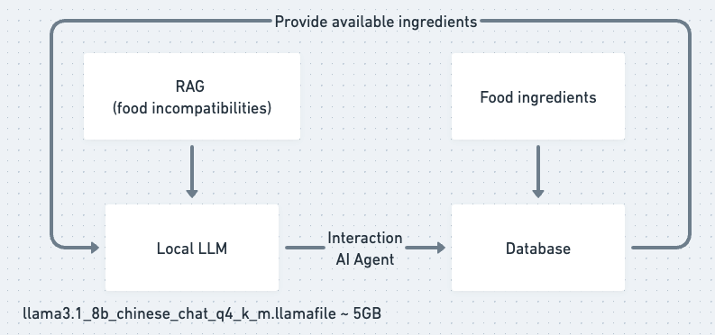
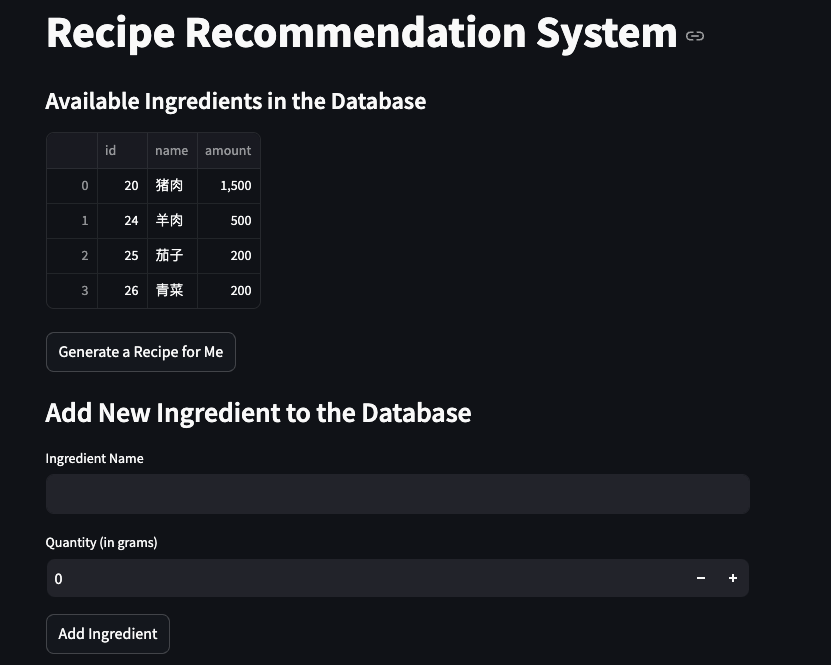

# smart recipe


## Final Demo Video
[Watch the final demo video here]()

## Project Purpose:
My mom often feels troubled when thinking about what dishes to cook. At the same time, there is a widely recognized concept in traditional Chinese medicine regarding food incompatibility. I want to develop a large model that can recommend recipes while also considering the properties of different foods.

## Architecture Diagram



## Installation and Usage
### Part1 - llamafile
1. Go to https://huggingface.co/shenzhi-wang/Llama3.1-8B-Chinese-Chat/tree/main/gguf and download the `llama3.1_8b_chinese_chat_q4_k_m.gguf` file ~4.92 GB.
2. Go to https://github.com/Mozilla-Ocho/llamafile, at the release page, download the latest version of the llamafile.
3. Unzip the llamafile and run the following command to convert the gguf file to llamafile:
```bash
$ ./llamafile-0.8.8/bin/llamafile-convert llama3.1_8b_chinese_chat_q4_k_m.gguf
```
4. Run the following command to start the llamafile locally:
```bash
$ ./Llama3-8B-Chinese-Chat-q8_0-v2_1.llamafile --server --nobrowser
```
### Part2 - Application download
5. Login to your Docker.
6. Click on the `Packages` on the right of the repo's main page(https://github.com/ljw-612/smart_recipe).
I am on macos with apple silicon, I run the following command to pull the image:
```
$ docker pull ghcr.io/ljw-612/smart-recipe:8677da68bd71e74dd0b00a0a9832a25cab7cfeca@sha256:f4020b61c979a5712694457c1917e52970c2177da9d5d6be143f4d91100a46de
```
7. Run the following command to start the container:
```bash
$ docker run --platform linux/amd64 --rm -it -p 8501:8501 -d --name smart-recipe IMAGE ID
```
Replace the `IMAGE ID` with the image id you just pulled. You can find the image id by running the following command:
```bash
$ docker images
```
8. Open your browser and go to `http://localhost:8501/`. You should see the following interface:



### Example

The project has the following features:
- By clicking the `Generate a Recipe for Me`, the system would generate a recipe for you based on the available ingredients and Chinese food incompatibility concepts.
- After a recipe is generated, you can either choose `accept` or `regenerate`. Once you accept the recipe, the system would remove the ingredients used in the recipe from the available ingredients database supported by LangChain SQL AI Agent.
- By clicking the `Add Ingredients`, you can add ingredients to the system.


## Language Model Used
`Llama-3-Chinese-8B-Instruct-v2-GGUF` is an LLM tuned on `Meta-Llama-3-8B-Instruct`, which can be used for conversation, QA, etc.
https://huggingface.co/hfl/llama-3-chinese-8b-instruct-v2

# Timeline

| Week                | Tasks             |
|---------------------|--------------------|
| Week 0 | Come up with a project idea and timeline |
| Week 1 | Research on food related datasets |
| Week 2 | Turn llama-3-chinese to llamafile |
| Week 3 | Test customized llamafile's performance |
| Week 4 | Collect and preprocess food related data |
| Week 5 | Combine food related data to the local model (RAG maybe?)|
| Week 6 + week 7 | Test the model's performance and start frontend backend development |
| Week 8 | Dorkerize |
| Week 9 | Final test and wrap up |
| week 10 | Documentations and presentation |

# Resources
## convert gguf files to llamafile
```
$ ./llamafile-0.8.8/bin/llamafile-convert Llama3-8B-Chinese-Chat-q8_0-v2_1.gguf
$ chmod +x Llama3-8B-Chinese-Chat-q8_0-v2_1.llamafile
```
## Run llamafile (langchain api)
```
$ ./Llama3-8B-Chinese-Chat-q8_0-v2_1.llamafile -c 2048 --server --nobrowser
```

docker build -t smart-recipe .
docker run -p 8501:8501 smart-recipe  

# References